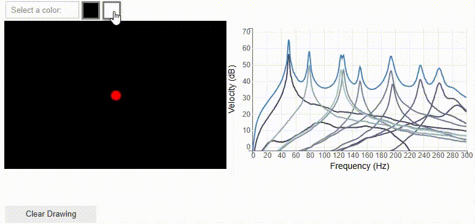

# Predicting Eigenmodes in Vibroacoustic Systems


This is the repo with code for the *Predicting Eigenmodes in Vibroacoustic Systems* paper (Link to pdf, to be added). 
The **ModeONet** uses the mode superposition to predict the velocity field of vibrating plate with a indentation pattern. It learns both the structure-dependent mode shapes and the frequency-dependent coefficients required to reconstruct the system’s velocity field.


This repository includes the implementation of ModeONet and an example notebook. 

---

## 🗎 Data

We split the training dataset into multiple files.
You can download them from [this Google Drive link](https://drive.google.com/drive/folders/1KuCCZvYJB8Yml3L5Pw6pQaNcCoFfrbTn?usp=sharing).

The test dataset is the same as used in
[**Guided Flow Matching Design Optimization for Minimal Structural Vibrations**](https://arxiv.org/abs/2506.15263)
and can be downloaded [here](https://data.goettingen-research-online.de/api/access/datafile/125125).

---

## 🎨 Plate Paint

Create your own indentation pattern and observe the live frequency response function.
Try it yourself in [this notebook](./notebooks/plate_paint.ipynb) or open it directly in Google Colab:


<a href="https://colab.research.google.com/github/ecker-lab/modeonet/blob/main/notebooks/plate_paint_google_colab.ipynb" target="_parent"></a>



---

## ⚙️ Installation

```bash
pip install -r ./requirements.txt
pip install .
```

---

## 🧠 Training a Model

Fill in all missing paths in [`./configs/paths.yaml`](./configs/paths.yaml).
By default, the entire dataset will be loaded into memory, requiring around **40 GB of RAM**.
You can disable this option in the same configuration file.

This repository uses [Weights & Biases](https://wandb.ai/) for logging.
To use it, create an account and log in with:

```bash
wandb login
```

Train the **ModeONet** model with:

```bash
python ./vibromodes/run.py ./configs/modeonet.yaml ./configs/paths.yaml \
    -w -t modeonet -n <run_name>
```


## 🧪 Unit Testing

Although the code is not fully covered by tests, basic unit tests are included.
Run them with:

```bash
python -m pytest ./tests
```

## 📂 File structure

The ModeONet Model is implemented in [this file](./vibromodes/models/ModeONet.py).

```
.
├── LICENSE
├── README.md
├── pyproject.toml
├── requirements.txt
├── configs
│   ├── fqo_unet.yaml                     #config for the FQO Model 
│   ├── modeonet.yaml                     #config for the ModeONet Model
│   └── paths.yaml                        #config for train and test paths
├── docs
│   ├── PlatePaint.gif
│   └── overview_figure.jpg
├── notebooks
│   ├── model.pth                         #final model weights
│   ├── plate_paint.ipynb                 #interactive drawing application
│   ├── plate_paint_google_colab.ipynb    #works on google colab
│   └── test_results.ipynb                #evaluates the model on the testset
├── tests
│   ├── __init__.py                     
│   ├── modeonet_test.py                  #tests the components of the ModeONet
│   ├── modes_test.py                     #tests the analytic mode response formular
│   └── velocity_field_test.py            #tests the transformation between different velocity field formats
└── vibromodes
    ├── __init__.py
    ├── config.py                         #global config
    ├── globals.py                        #global constants
    ├── hdf5_dataset.py                   #dataset
    ├── kirchhoff.py                      #analytic solution to a plate without a beading pattern
    ├── log.py                            #logger
    ├── loss.py                           #calculates the phase and magnitude loss
    ├── metrics.py                        #calculates the evaluation metrics
    ├── models                  
    │   ├── __init__.py
    │   ├── FQOUNet.py                    #implementation of the FQO
    │   ├── ModeONet.py                   #implementation of the ModeONet
    │   └── nn.py                         #general neural network  building blocks 
    ├── modes.py                          #analytic mode response
    ├── plotting.py                       #some plotting functions
    ├── run.py                            #trainings script / main entry point
    ├── train.py                          #trainings loop
    ├── utils.py                          #some utility functions
    └── velocity_field.py                 #conversion between different formats of velocity fields

```


## 📚 Citation


The training and test datasets build upon
[our previous project](https://github.com/ecker-lab/Optimizing_Vibrating_Plates)
on optimizing structural vibration:

```bibtex
@article{delden2025minimizing,
  author={van Delden, Jan and Schultz, Julius and Rothe, Sebastian and Libner, Christian and Langer, Sabine C. and L{\"u}ddecke, Timo},
  title={Minimizing Structural Vibrations via Guided Flow Matching Design Optimization},
  journal={arXiv preprint arXiv:2506.15263},
  year={2025},
}
```

